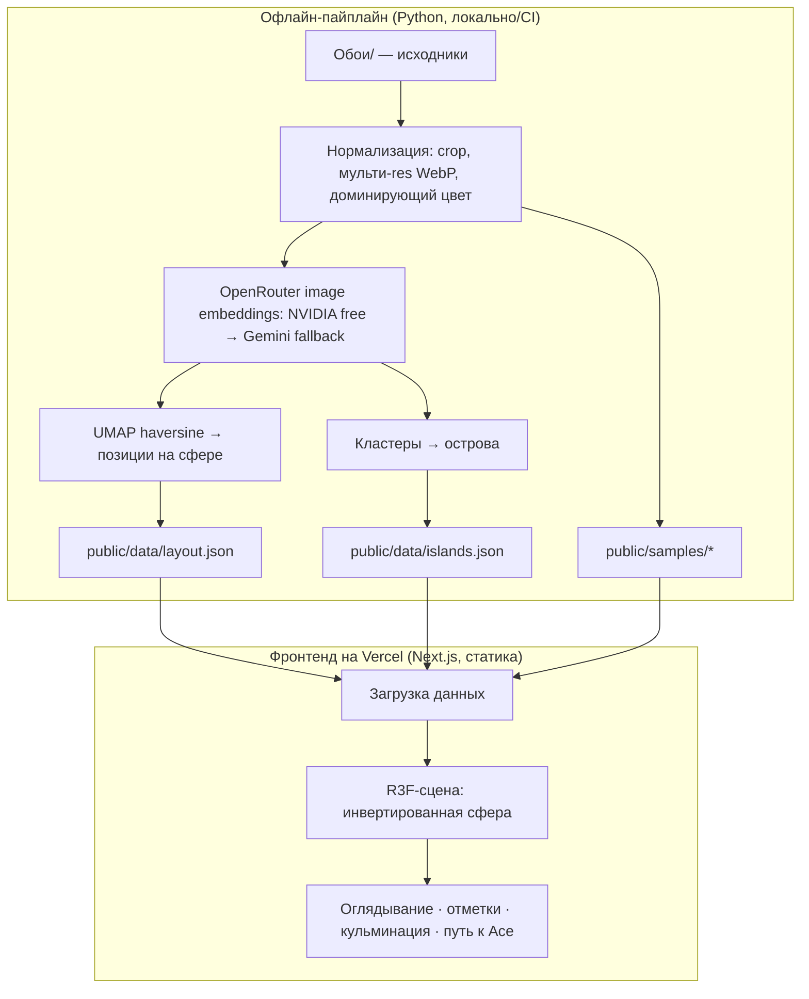
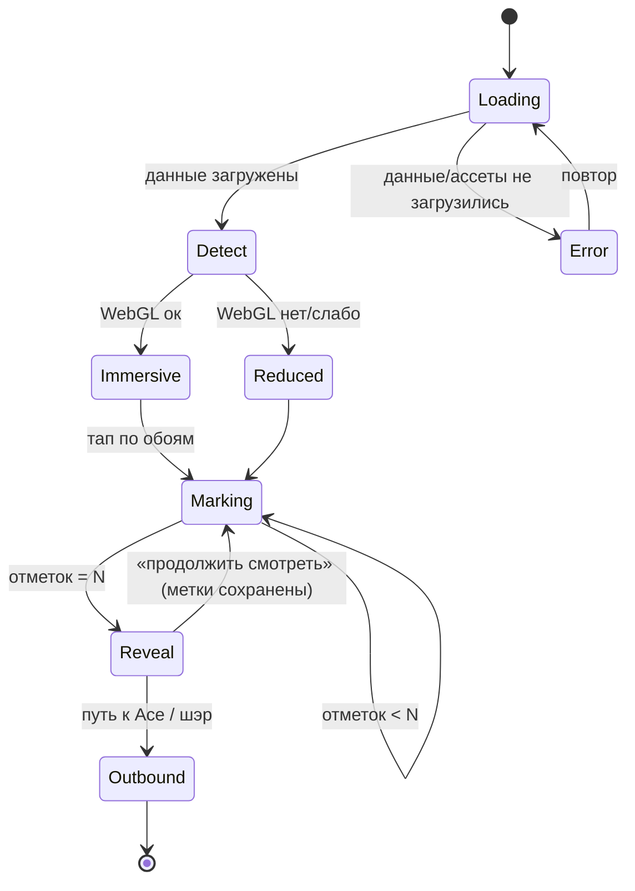

# Планетарий вкуса - Plan

**Target repo:** `serg-shcherbak/asya-wallpaper` (https://github.com/serg-shcherbak/asya-wallpaper). Deploy target: Vercel.

## Goal Capsule

- **Objective.** Построить и задеплоить на Vercel иммерсивный desktop-first веб-опыт «Планетарий вкуса»: тёмная сфера, внутри которой обои Аси разложены по визуальной похожести; посетитель оглядывается, отмечает любимое и получает «свой остров в мире Аси» с мягким путём к знакомству с Асей. Цель — сильный эмоциональный «вау»-отпечаток для медленного прогрева тёплой аудитории.
- **Product authority.** Владелец продукта — пользователь; Ася — авторитет вкуса и контента (финальный отбор сэмплов, имена островов). Активный скоуп — единый опыт плюс офлайн-пайплайн данных, что его питает. Product Contract ниже — источник истины по WHAT; этот план добавляет HOW.
- **Execution profile.** Deep, ~16 юнитов, фазами. Две подсистемы: офлайн data-пайплайн (Python) и фронтенд-планетарий (Next.js + React Three Fiber). Приоритет полировки — иммерсия. План рассчитан на автономный прогон `lfg` в отдельном агенте.
- **Stop conditions / blockers.** Нет блокеров планирования. Финальный набор сэмплов и имена островов поступают от Аси и вставляются как контент; до тех пор используются авто-кластеры и плейсхолдер-имена. Не коммитить реальный `VERCEL_TOKEN` (см. Assumptions — токен из `.env.example` подлежит перевыпуску).
- **Tail ownership.** Прогон через `lfg`: план → имплементация → ревью → PR → зелёный CI и рабочий Vercel preview. Production deploy следует из merge в `main` и не входит в немерджущий LFG-tail.

---

## Product Contract

Product Contract unchanged from the requirements-only version (WHAT preserved; only HOW added below).

### Summary

Иммерсивный desktop-first веб-опыт: посетитель стоит в центре тёмной сферы, обои Аси горят созвездиями по внутренним стенкам купола, разложенные по визуальной похожести. Он бесконечно оглядывается, отмечает откликающиеся обои — и они кристаллизуются в «его остров внутри мира Аси», откуда есть мягкий путь к самой Асе.

### Problem Frame

Ася получает клиентов через медленный прогрев: люди приходят со словами «давно мечтала с тобой поработать», иногда спустя год-два после первого касания. Точка боли — у такого прогрева нет носителя: сайт и соцсети показывают работы, но не *передают вкус* так, чтобы он оставил отпечаток и отличался от привычных generic-галерей обоев. Стоимость проблемы не в упущенной сиюминутной конверсии, а в том, что тёплая аудитория уходит без эмоционального якоря. Обычный каталог этот якорь не создаёт — он ощущается как альбом.

### Key Decisions

- **Форма — планетарий-сфера, а не плоская карта** (session-settled: user-directed — chosen over плоская зумируемая карта / сетка превью: сетка ощущалась как generic-альбом; иммерсия важнее навигации, метафора «Google Earth наизнанку» даёт бесконечный мир без тупиков).
- **Payoff — «твой остров в мире Аси», не «% совпадения»** (session-settled: user-directed — chosen over числовой процент совместимости: вся карта = вкус Аси, дистанцию мерить не с кем; расположение внутри её мира честнее и лестнее).
- **Минимум текста** (session-settled: user-directed — chosen over истории у каждого сэмпла / именованный портрет: смысл несут визуал и движение; из слов только имена островов).
- **Двигатель «вау» — живой мир, а не сетка** (session-settled: user-directed).
- **Desktop-first** (session-settled: user-directed — chosen over mobile-first: опыт ярче на большом экране).
- **Реальное 3D (WebGL) с деградацией для слабых устройств** (session-settled: user-approved).
- **Раскладка по эмбеддингам считается офлайн заранее** (session-settled: user-approved — статичные предвычисленные данные).
- **Приоритет полировки — само погружение в мир** (session-settled: user-directed).

### Actors

- A1. **Посетитель** — тёплый пользователь из каналов Аси; гуляет, отмечает, получает остров, уходит с отпечатком или связывается с Асей.
- A2. **Ася** — авторитет вкуса и контента: курирует финальный набор сэмплов и имена островов.
- A3. **Пайплайн данных** — офлайн-препроцессинг: нормализация, эмбеддинги, проекция на сферу, кластеры островов.

### Requirements

**Мир и погружение**

- R1. Опыт открывается как тёмная сфера, в центре которой находится посетитель; обои Аси размещены по внутренним стенкам купола.
- R2. Посетитель свободно оглядывается: горизонтальное вращение бесконечно, вертикальный наклон ограничен; краёв и тупиков нет.
- R3. Обои разложены по визуальной похожести — соседние похожи, а близкие по вкусу образуют видимые скопления-«острова».
- R4. Издалека острова читаются как светящиеся цветовые области (поле доминирующих цветов), вблизи распадаются на конкретные обои в резкости и масштабе.
- R5. Мир живёт без действий пользователя: лёгкое амбиентное движение, глубина, размытие дальнего плана.
- R6. Единственный текст в мире — имена островов; подписей-историй у отдельных сэмплов нет.

**Отметки и подборка**

- R7. Посетитель отмечает понравившиеся обои прямым действием (клик/тап) с приятной анимацией отклика.
- R8. Отмеченные обои визуально закреплены как выбранные и копятся в подборку.
- R9. По достижении порога отметок открывается кульминация; порог ощущается естественно, а не как барьер.

**Кульминация: твой остров**

- R10. Кульминация показывает «твой остров в мире Аси»: отмеченные обои загораются личным созвездием на куполе, локализуя посетителя внутри мира Аси.
- R11. Остров назван (имя острова Аси, к которому тяготеет посетитель); формулировка ставит посетителя рядом с Асей, без числового процента.
- R12. Кульминация показывает подборку — обои этого острова — как результат «вот твой вкус».
- R13. Момент раскрытия кинематографичен (сборка/загорание созвездия) — эмоциональный пик опыта.

**Путь к Асе и шэринг**

- R14. С экрана результата есть мягкий ненавязчивый путь к Асе («хочу так же у себя» → знакомство/связь), не форсирующий контакт.
- R15. Результат можно шэрить (ссылка или изображение) как приятный бонус, не как основную механику.

**Контент и пайплайн**

- R16. Финальный набор сэмплов курирует Ася; число не фиксировано (ориентир — до ~300, возможно меньше после отбора).
- R17. Изображения нормализуются к единому кадру/пропорциям перед раскладкой — у исходников разные соотношения сторон.
- R18. Раскладка по похожести вычисляется офлайн заранее (эмбеддинги → проекция → позиции на сфере); фронтенд загружает готовые данные.
- R19. Острова получают имена, курируемые Асей поверх авто-кластеров (ориентир ~6–12 островов).

**Платформа и перформанс**

- R20. Desktop-first: опыт оптимизирован под большой экран; на мобильных остаётся работоспособным (адаптив или упрощение).
- R21. Основной рендер — реальное 3D (WebGL); при отсутствии/слабости WebGL включается деградированный режим.
- R22. Иммерсия — приоритет полировки: плавность движения, глубина и качество переходов важнее второстепенных фич.

### Key Flows

- F1. **Погружение и прогулка.** **Trigger:** заход. **Steps:** открывается купол → оглядывается и приближает → мир дышит. **Outcome:** залипание. **Covers:** R1–R6, R22.
- F2. **Отметки.** **Trigger:** находит откликающиеся обои. **Steps:** клик → анимация отклика → копится подборка. **Covers:** R7, R8.
- F3. **Раскрытие острова.** **Trigger:** достигнут порог отметок. **Steps:** сборка личного созвездия → имя острова → подборка. **Outcome:** «это я, я внутри мира Аси». **Covers:** R9–R13.
- F4. **Мягкий переход к Асе.** **Trigger:** экран результата. **Steps:** ненавязчивое приглашение + опция шэра. **Covers:** R14, R15.

### Acceptance Examples

- AE1. **Covers R9.** When посетитель отметил меньше порога обоев, кульминация не запускается — мир остаётся открытым.
- AE2. **Covers R9, R10.** When достигнута пороговая отметка, запускается раскрытие острова.
- AE3. **Covers R4.** When посетитель отдалён, обои читаются как цветовые облака; when приближается — те же обои в резкости.
- AE4. **Covers R2.** When посетитель вращается по горизонтали дольше полного оборота, он не упирается в край.
- AE5. **Covers R21.** When устройство не тянет WebGL, включается деградированный режим, сохраняющий базовый опыт (оглядывание, отметки, результат).
- AE6. **Covers R14.** When посетитель на экране результата, путь к Асе присутствует, но не перекрывает экран и не форсирует контакт.

### Success Criteria

- Тестовые зрители описывают опыт как «мир / красиво / не как везде», а не «галерея / каталог».
- Ключевая эмоция считывается без слов, при минимуме текста.
- Мягкий путь к Асе воспринимается как приглашение, а не продажа.
- Перформанс: плавное движение на целевом десктопе; на мобильном — деградация без поломки.

### Scope Boundaries

**Deferred for later**

- «Примерь на стену» — рендер обоев в интерьере и комнаты-мудборды.
- Амбиентный звук (учесть ограничения автоплея в браузерах).
- Загрузка посетителем своих изображений в мир.
- Serverless-форма лидов и динамическая генерация OG-картинок (v1 остаётся без бэкенда).

**Outside this product's identity**

- Квиз с числовым «процентом совместимости».
- Истории / эссе у каждого сэмпла.
- Плоская зумируемая карта или сетка превью как главный экран.
- Генеративное «перетекание» обоев друг в друга.
- Оптимизация конверсии холодного трафика.

#### Deferred to Follow-Up Work

- CMS/админка для правки островов и порядка сэмплов без переген­ерации пайплайна.
- Аналитика поведения (тепловая карта отметок, популярные острова).

---

## Planning Contract

**Approach.** Две развязанные подсистемы вокруг статического контракта данных. Офлайн-пайплайн (Python) один раз перегоняет `Обои/` в нормализованные веб-ассеты + `layout.json`/`islands.json` и коммитит их в `public/`. Фронтенд (Next.js + React Three Fiber) — чисто статический билд на Vercel, который грузит эти данные и рендерит инвертированную сферу: камера в центре, обои-спрайты биллбордами по позициям, поверх — поле цветовых «туманностей» островов. Взаимодействие (оглядывание, отметки) и кульминация («твой остров») живут целиком на клиенте. Бэкенда в v1 нет.

### Key Technical Decisions

**Пайплайн и данные**

- KTD1. **Раскладка считается офлайн, выход коммитится как статика; Vercel хостит только фронтенд** (session-settled: user-approved — chosen over рантайм-компьют на Vercel: эмбеддинги и UMAP не нужны посетителю, а статический контракт снимает serverless-лимиты; см. Product Contract R18). Пайплайн запускается локально/в CI, не в рантайме приложения.
- KTD2. **Эмбеддинги через OpenRouter, затем сферическая проекция.** Primary — `nvidia/llama-nemotron-embed-vl-1b-v2:free`; fallback — `google/gemini-embedding-2`. Нормализованный `md`-кадр отправляется как image input в `/api/v1/embeddings`, ответ кэшируется по content hash + точному model ID. Один релизный batch использует только одну модель: при переключении fallback весь набор пересчитывается в отдельном cache namespace, потому что векторы разных моделей несопоставимы. Платный fallback запускается только после canary и оценки стоимости ниже `OPENROUTER_MAX_COST_USD` (по умолчанию `$0.45` при доступном балансе `$0.50`). Далее UMAP с `output_metric='haversine'` переводит векторы в (lat, lon) и точки на единичной сфере. Если визуальная проверка сферической проекции проваливается, UMAP 3D → нормализация на сферу остаётся execution-time экспериментом, а не вторым постоянным путём.
- KTD3. **Кластеры-острова с гарантией пространственной цельности на сфере.** V1 использует KMeans в пространстве эмбеддингов, число кластеров ~6–12 (R19). **Контур-гейт:** после проекции проверяется, что члены кластера пространственно компактны на сфере (угловой разброс ниже порога); если нет — острова переопределяются по спроецированным позициям, чтобы центроид и «туманность» не размазались по чужим обоям. Центроид `{x,y,z}` и доминирующий цвет — только по согласованным (компактным) кластерам. Стабильные публичные `islandId` живут в `pipeline/island_ids.json`: id привязан к одному или нескольким anchor-сэмплам, а rebuild сохраняет id, пока anchor однозначно попадает в кластер. Потерянный/неоднозначный anchor останавливает публикацию до ручного remap; новый кластер получает новый id. HDBSCAN не входит в активный v1-путь.
- KTD4. **Нормализация изображений (R17): единый квадратный кадр (умный center-crop), три WebP-разрешения, удаление EXIF и извлечение доминирующего цвета** для цветового поля. Тиры: `sm` (далёкий LOD ~128px), `md` (ближний ~512–768px), `lg` (сфокусированный ~1024–1536px). `lg` грузится только для одного сэмпла в фокусе — иначе близкий план на десктопе (1440p+) читается мыльно и не держит обещание «в резкости» (R4), а поднимать `md` для всех ~300 бьёт по весу.
- KTD5. **Контракт данных.** `public/data/layout.json` — массив сэмплов `{ id, srcset: {sm, md, lg}, dominantColor, pos: {x,y,z} на единичной сфере, islandId, islandAffinity: [{islandId, weight}] }`. `islandAffinity` — предвычисленные веса близости сэмпла к ближайшим островам (по расстоянию до центроидов в пространстве эмбеддингов); даёт устойчивое мягкое определение острова в рантайме без эмбеддингов на клиенте (см. KTD9). `public/data/islands.json` — `{ id, name, centroid: {x,y,z}, color }`; `id` **стабилен между прогонами** (не зависит от порядка кластеров). Фронтенд знает только про этот контракт.

**Рендер и взаимодействие**

- KTD6. **Стек — Next.js (App Router, TypeScript) + React Three Fiber / three.js** (session-settled: user-approved — chosen over Vite+three статикой: Vercel-нативность, задел под лёгкие функции, привычная сборка).
- KTD7. **Инвертированная сфера.** Камера остаётся в центре, спрайты-обои позиционируются по `pos` и биллбордятся лицом к центру. Управление — вращение вида (yaw бесконечный, pitch с клампом), зум через FOV, инерция + лёгкий амбиентный дрейф (R2, R5).
- KTD8. **LOD (R4).** Далеко — лёгкие точки/спрайты доминирующего цвета + аддитивные «туманности» островов; при приближении подгружается и проявляется текстура обоев. Стриминг текстур по дистанции, ограничение одновременно резких тайлов.
- KTD9. **Определение острова в кульминации — устойчивое к малому N (R10–R11).** Плюрализм-голосование по 5–7 отметкам на ~6–12 островов статистически шумный (сплит 2-1-1-1 решается одним голосом → остров случаен и нестабилен). Вместо этого: каждый остров получает счёт = сумма `islandAffinity`-весов отмеченных сэмплов; выбирается остров с максимальным счётом при минимальном отрыве от второго. По умолчанию показывается один остров (сохраняет «твой остров», R11). Созвездие = подсветка отмеченных + сэмплы этого острова. Если отрыв не набран — см. Open Questions (вариант «на стыке двух островов» флагнут пользователю, по умолчанию не включён).

**Продуктовая поверхность и платформа**

- KTD10. **Исходящие пути v1 без бэкенда** (session-settled: user-approved — chosen over serverless-форма/динамические OG: держим v1 статичным, без PII). Контакт с Асей — внешняя ссылка (Telegram/Instagram/mailto, значение в конфиге). Шэр — **пре-рендеренные пути `/result/[islandId]`**: статический export Next.js (`output: 'export'`) получает полный список островов через `generateStaticParams`, а серверный route-компонент читает `islands.json` на build-time. У каждого пути своя статичная OG-картинка и заголовок; неизвестный `islandId` не генерируется и отдаёт 404. Query-параметр `?island=` для OG не годится: соцкраулеры не исполняют клиентский JS, и чисто-статический билд отдал бы всем ссылкам одинаковую OG-мету; `island=` остаётся лишь опциональным deep-link в живую сцену. Сами картинки `public/share/<id>.jpg` генерит шаг пайплайна (см. U5/U13), не рисуются вручную.
- KTD11. **Фолбэк — деградация, а не второй движок** (session-settled: user-approved — chosen over полноценный CSS-3D-движок: не удваивать стройку; сужает pseudo-3D-намёк R21). Детект WebGL/перфа → упрощённый режим: меньше плотность, `prefers-reduced-motion`, статичнее камера; отметки и кульминация сохраняются (AE5).
- KTD12. **Desktop-first responsive** (session-settled: user-directed — R20). Мобильный — сниженная плотность и упрощённые эффекты, тот же поток.

### High-Level Technical Design

Система из двух подсистем вокруг статического контракта данных:



Рантайм-состояние сцены и деградация:



### Assumptions

- Точные версии Next.js, React Three Fiber/three, UMAP и Python-зависимостей читаются и пинуются на этапе скаффолда. Контракт OpenRouter embeddings и оба model ID проверены по актуальному каталогу перед имплементацией.
- Менеджер пакетов — pnpm; тесты — Vitest (юнит/компонент) + Playwright (рантайм-смоук); пайплайн — pytest. Выбор зафиксирован для конкретики Verification Contract; равнозначная замена допустима, если единообразна.
- **Секрет-гигиена:** реальный `VERCEL_TOKEN`, попавший в `.env.example`, считается скомпрометированным — перевыпустить в Vercel (на пользователе). В репозитории `.env.example` содержит только плейсхолдер; `.env` в `.gitignore`; деплой-токен живёт в Vercel/CI-секретах, не в рантайме приложения.
- Имена островов и финальный отбор сэмплов — контент от Аси; до поставки используются авто-кластеры и плейсхолдер-имена, вынесенные в редактируемый `islands.json`.
- Значение контактного канала Аси (Telegram/Instagram/mailto) — конфиг/ENV, вставляется без изменения кода.
- Исходный `Обои/` (на момент планирования 328 файлов) — рабочий вход; пайплайн переносит только курированное подмножество.
- **Стабильность раскладки и шэр-ссылок.** UMAP пинуется single-threaded (`n_jobs=1`) — иначе `random_state` не даёт воспроизводимости и тест детерминизма флакает. Раскладка фиксируется как версионируемый релизный артефакт после того, как Ася отдаёт финальный набор; перегенерация — явное версионное событие. `islandId` назначается стабильно (не по порядку кластеров), чтобы ранее расшаренные ссылки `/result/<id>` не начали указывать на другой/несуществующий остров; `public/share/<id>.jpg` перегенерируются при каждой пересборке раскладки.
- Отметки живут только в памяти текущего посещения: перезагрузка начинает новый сеанс. Шэр-ссылка хранит только итоговый `islandId`, а не список отмеченных обоев.
- Локальный каталог пока не инициализирован как Git checkout, но целевой пустой GitHub-репозиторий `serg-shcherbak/asya-wallpaper` существует и доступен на запись; U1 включает безопасный bootstrap репозитория до первого коммита.

### Sequencing

Фаза A — офлайн-пайплайн и контракт данных (U1–U5). Фаза B — ядро сцены и взаимодействие (U6–U11). Фаза C — кульминация и исходящие пути (U12–U13). Фаза D — устойчивость, адаптив и деплой (U14–U16). Фазы B–C зависят от контракта данных из A (можно вести параллельно на фикстурах, но интеграция после A).

---

## Output Structure

```text
asya-wallpaper/
  pipeline/                 # офлайн (Python), не деплоится
    normalize.py            # U2
    embed.py                # U3
    layout.py               # U3
    islands.py              # U4
    island_ids.json         # U4 — стабильные публичные id и anchor-сэмплы
    share.py                # U5 — генерит public/share/<id>.jpg на остров
    run.py                  # U5 — единая команда
    requirements.txt        # U5
    README.md               # U5
    tests/                  # pytest для U2–U5
  public/
    samples/                # нормализованные обои, мульти-res (выход пайплайна)
    data/
      layout.json           # позиции + метаданные сэмплов
      islands.json          # острова: id, имя, центроид, цвет
    share/                  # статичные картинки-превью на остров (U13)
  src/
    app/                    # Next.js App Router
      page.tsx              # вход в опыт
      layout.tsx
      result/               # маршрут кульминации/шэра (U12–U13)
    components/
      Planetarium/          # сцена (U7), туманности (U8), controls (U9), LOD (U10)
      Marking/              # взаимодействие отметок (U11)
      Reveal/               # «твой остров» (U12)
      Fallback/             # деградированный режим (U14)
    lib/
      data.ts               # загрузка/типы контракта (U6)
      types.ts              # типы контракта (U6)
      selection.ts          # стор отметок (U11)
      island.ts             # логика определения острова (U12)
      capabilities.ts       # детект WebGL/перфа (U14)
      config.ts             # N (U11) + контактный канал Аси (U13)
    **/__tests__/           # Vitest/Testing Library рядом с владельцем поведения
  e2e/                      # Playwright: основной, reduced и share-потоки
  .env.example              # только плейсхолдеры
  .gitignore
  vercel.json               # при необходимости (U16)
  next.config.mjs
  package.json
```

---

## Implementation Units

| U-ID | Юнит | Ключевые файлы | Зависит от |
|---|---|---|---|
| U1 | Скаффолд репозитория и тулинг | `package.json`, `next.config.mjs`, `.gitignore`, `.env.example` | — |
| U2 | Нормализация изображений | `pipeline/normalize.py`, `public/samples/` | U1 |
| U3 | OpenRouter-эмбеддинги и раскладка на сфере | `pipeline/embed.py`, `pipeline/layout.py`, `public/data/layout.json` | U2 |
| U4 | Кластеры и метаданные островов | `pipeline/islands.py`, `public/data/islands.json` | U3 |
| U5 | Оркестрация и воспроизводимость пайплайна | `pipeline/run.py`, `pipeline/requirements.txt`, `pipeline/README.md` | U2, U3, U4 |
| U6 | Слой загрузки данных и типы | `src/lib/data.ts` | U1 |
| U7 | Основание сцены: инвертированная сфера | `src/components/Planetarium/Scene.tsx` | U6 |
| U8 | Слой цветовых туманностей островов | `src/components/Planetarium/Nebula.tsx` | U7 |
| U9 | Управление камерой (оглядывание/зум/дрейф) | `src/components/Planetarium/Controls.ts` | U7 |
| U10 | LOD и стриминг текстур | `src/components/Planetarium/lod.ts` | U7, U8 |
| U11 | Взаимодействие отметок и подборка | `src/components/Marking/`, `src/lib/config.ts` | U7, U9 |
| U12 | Кульминация «твой остров» | `src/components/Reveal/`, `src/lib/island.ts` | U4, U6, U11 |
| U13 | Путь к Асе и шэринг | `src/app/result/`, `src/lib/config.ts`, `public/share/` | U5, U6, U12 |
| U14 | Детект возможностей и деградированный режим | `src/lib/capabilities.ts`, `src/components/Fallback/` | U6, U7, U11, U12 |
| U15 | Desktop-first адаптив и полировка | `src/app/`, компоненты сцены | U8, U9, U10, U12, U14 |
| U16 | Конфиг деплоя на Vercel и CI | `vercel.json`, `next.config.mjs`, CI-workflow | U5, U6, U13, U14, U15 |

### U1. Скаффолд репозитория и тулинг

- **Goal.** Инициализировать Next.js (App Router, TS) проект с линтом, тест-раннерами и секрет-гигиеной.
- **Requirements.** Основание под R1–R22; напрямую R20.
- **Dependencies.** —
- **Files.** `package.json`, `next.config.mjs`, `tsconfig.json`, `.gitignore`, `.env.example`, `vitest.config.ts`, `playwright.config.ts`.
- **Approach.** Инициализировать Git на `main`, привязать существующий пустой `serg-shcherbak/asya-wallpaper` как `origin`, затем создать рабочую feature-ветку. Скаффолдить Next.js (TS, App Router), добавить Vitest + Testing Library и Playwright. `.gitignore` включает `.env`, `node_modules`, `.next`, `out` и Python-кэши. `.env.example` — только `VERCEL_TOKEN=`, `NEXT_PUBLIC_CONTACT_URL=`, `OPENROUTER_API_KEY=` и `OPENROUTER_MAX_COST_USD=0.45`; реальные значения не коммитятся.
- **Execution note.** Прежде всего убрать реальный токен из `.env.example` (заменить плейсхолдером) — до первого коммита/пуша.
- **Patterns to follow.** Дефолтные конвенции Next.js App Router; новый репозиторий.
- **Test scenarios.** `Test expectation: none -- скаффолд/конфиг; проверяется смоуком: dev-сервер стартует, `pnpm build` проходит, `.env.example` не содержит секретов.`
- **Verification.** `pnpm dev` поднимает пустую страницу; `pnpm build` зелёный; tracked-file scan не находит `vcp_` и `sk-or-v1-`; `.env` не tracked.

### U2. Нормализация изображений

- **Goal.** Перегнать курированные `Обои/` в нормализованные мульти-res веб-картинки + доминирующий цвет на сэмпл.
- **Requirements.** R16, R17.
- **Dependencies.** U1.
- **Files.** `pipeline/normalize.py`, `pipeline/tests/test_normalize.py`, выход `public/samples/<id>/{sm,md,lg}.webp`, промежуточный `pipeline/out/samples.json`.
- **Approach.** Читать список сэмплов (манифест или всё из `Обои/`), умный center-crop к квадрату, ресайз в три тира (`sm` ≈128px, `md` ≈640px, `lg` ≈1024–1536px), удалить EXIF/встроенные метаданные и кодировать в WebP. Извлекать доминирующий цвет (например, срез палитры по k-means/quantize). Писать per-sample запись `{id, srcset:{sm,md,lg}, dominantColor}`.
- **Patterns to follow.** Pillow для обработки; стабильный `id` из имени файла (slug/hash).
- **Test scenarios.**
  - Happy path: файл 3:2 → квадратные `sm`/`md` без искажения пропорций (crop, не squash).
  - Edge: очень широкая/узкая картинка → кроп по центру, без падения.
  - Edge: не-изображение/битый файл в папке → пропуск с предупреждением, пайплайн не падает.
  - Covers R17. Доминирующий цвет — валидный hex, детерминирован при повторном прогоне того же файла.
  - Выходные WebP не содержат EXIF/GPS/авторских metadata исходника.
- **Verification.** Прогон на срезе `Обои/` создаёт `public/samples/*` и запись с корректными полями; повторный прогон идемпотентен.

### U3. OpenRouter-эмбеддинги и раскладка на сфере

- **Goal.** Посчитать единообразные image embeddings через OpenRouter и спроецировать их на сферу так, чтобы похожее лежало рядом.
- **Requirements.** R3, R18; питает R4.
- **Dependencies.** U2.
- **Files.** `pipeline/embed.py`, `pipeline/layout.py`, `pipeline/tests/test_layout.py`, выход `public/data/layout.json`.
- **Approach.** `embed.py` отправляет нормализованные `md`-кадры в OpenRouter embeddings API с provider preference `data_collection: deny`. Сначала canary на 3–5 изображениях проверяет авторизацию, image input, размерность и модель ответа. Полный batch пробует NVIDIA free; при недоступности пересчитывает весь набор через Gemini в отдельном model-keyed cache, только если оценка и накопленная usage-cost не превышают `OPENROUTER_MAX_COST_USD`. Частичные векторы разных моделей никогда не объединяются. UMAP с `output_metric='haversine'` → (lat, lon) → `pos {x,y,z}` на единичной сфере (KTD2); `random_state` фиксирован, `n_jobs=1`. Собрать `layout.json` из `pos` + записей U2. UMAP 3D → сфера не остаётся в релизном коде, если эксперимент не выигрывает визуальный гейт.
- **Execution note.** Сначала прогнать на 20–30 сэмплах и глазами проверить, что визуально похожие соседствуют, до полного прогона.
- **Patterns to follow.** Кэш по content hash + model ID; retry с exponential backoff только для 429/529; явные ошибки 401/402; никакой сети в тестах.
- **Test scenarios.**
  - До U4 каждая запись `layout.json` имеет `id, srcset, dominantColor, pos{x,y,z}` и `|pos|≈1`; `islandId` и `islandAffinity` добавляет U4.
  - Детерминизм: два прогона с тем же seed дают идентичные позиции.
  - Mock NVIDIA success → весь batch и cache metadata содержат только NVIDIA model ID; повторный прогон читает cache и не вызывает API.
  - Mock NVIDIA unavailable → после canary весь batch пересчитывается Gemini; ни один NVIDIA-вектор не попадает в Gemini-layout.
  - Оценка Gemini выше `OPENROUTER_MAX_COST_USD` или API возвращает 402 → пайплайн останавливается до платного batch без частичного `layout.json`.
  - 429/529 ретраятся ограниченно с backoff; 401 и неверная размерность завершают шаг с понятной ошибкой.
  - Covers R3. Синтетический вход (две явно разные группы картинок) → в проекции группы разделяются (расстояние между-группами > внутри-групповое).
- **Verification.** `layout.json` содержит запись на каждый нормализованный сэмпл; ручная проверка соседства на срезе выглядит осмысленно.

### U4. Кластеры и метаданные островов

- **Goal.** Выделить острова из эмбеддингов и собрать редактируемый `islands.json` с плейсхолдер-именами.
- **Requirements.** R19; питает R10–R12.
- **Dependencies.** U3.
- **Files.** `pipeline/islands.py`, `pipeline/island_ids.json`, `pipeline/tests/test_islands.py`, выход `public/data/islands.json`; проставляет `islandId` в `layout.json`.
- **Approach.** KMeans в пространстве эмбеддингов, тюнинг к ~6–12 островам (KTD3). **Контур-гейт:** проверить компактность членов кластера на сфере после проекции; при разбросе выше порога — переопределить острова по спроецированным позициям. На остров: центроид `{x,y,z}`, доминирующий цвет, `name` = плейсхолдер. Публичный `islandId` берётся из persistent anchor-registry `pipeline/island_ids.json`; потерянный или неоднозначный anchor — fail-closed с отчётом для ручного remap, а не тихая перенумерация share routes. Каждому сэмплу проставить `islandId` и `islandAffinity` (веса близости к N ближайшим центроидам в пространстве эмбеддингов) для устойчивого раскрытия (KTD9).
- **Patterns to follow.** Имена вынесены так, чтобы Ася правила только `name` без перегенерации.
- **Test scenarios.**
  - Каждый сэмпл в `layout.json` получает валидный `islandId`, присутствующий в `islands.json`.
  - Число островов в целевом диапазоне (≈6–12) на реальном наборе.
  - Контур-гейт: угловой разброс членов каждого острова на сфере ниже порога (иначе острова переопределены по позициям).
  - У каждого сэмпла непустой `islandAffinity`; веса убывают, ближайший остров = `islandId`.
  - Стабильность `islandId`: повторный прогон и умеренное изменение состава при сохранённых anchors дают те же публичные id; потерянный/неоднозначный anchor останавливает публикацию до remap.
  - Правка `name` в `islands.json` не требует пересчёта позиций (поле независимо).
- **Verification.** `islands.json` валиден, центроиды и цвета заполнены; счётчик островов в диапазоне.

### U5. Оркестрация и воспроизводимость пайплайна

- **Goal.** Один воспроизводимый прогон, пересобирающий все данные из `Обои/`.
- **Requirements.** R16–R19 (операционно).
- **Dependencies.** U2, U3, U4.
- **Files.** `pipeline/run.py`, `pipeline/share.py`, `pipeline/requirements.txt`, `pipeline/README.md`, `pipeline/tests/test_run.py`, `pipeline/tests/test_share.py`.
- **Approach.** `run.py` последовательно вызывает normalize → embed → layout → islands → **share** (рендер `public/share/<islandId>.jpg` на остров: доминирующий цвет острова + несколько репрезентативных превью его сэмплов). Пиновать зависимости. Раскладка после поставки финального набора фиксируется как версионируемый артефакт; пересборка — явное событие, при котором перегенерируются и `public/share/*`. README: установка, запуск, куда падают ассеты, как править имена островов, как версионировать пересборку.
- **Patterns to follow.** Идемпотентность; кэш эмбеддингов переиспользуется.
- **Test scenarios.**
  - Covers R18. Чистый прогон на срезе создаёт `public/samples/*`, `layout.json`, `islands.json` одной командой.
  - Повторный прогон не дублирует и не мусорит вывод.
- **Verification.** `python pipeline/run.py` с нуля даёт консистентный набор данных; README достаточно, чтобы повторить.

### U6. Слой загрузки данных и типы

- **Goal.** Типобезопасно загрузить контракт данных и дать резолвер путей ассетов сцене.
- **Requirements.** Питает R1, R3, R4.
- **Dependencies.** U1 (сборка и тесты идут на фикстуре + контракте KTD5; реальные данные — на интеграции Фаза A→B, см. Sequencing).
- **Files.** `src/lib/data.ts`, `src/lib/types.ts`, `src/lib/__tests__/data.test.ts`, фикстуры `src/lib/__fixtures__/layout.sample.json` и `src/lib/__fixtures__/islands.sample.json`.
- **Approach.** Типы `Sample`, `Island`, `Layout` (`srcset:{sm,md,lg}`, `islandAffinity`). Загрузка `layout.json`/`islands.json` (fetch из `public/data`). Валидация формы; резолвер `srcset` → URL в `public/samples`. Различать уровни отказа: битая запись — внятная ошибка; **отказ/пустой fetch всего файла — сигнал верхнего уровня для экрана ошибки** (см. U14), а не молчаливый пустой мир.
- **Patterns to follow.** Единый источник типов для всех компонентов сцены.
- **Test scenarios.**
  - Валидная фикстура парсится в типизированные объекты.
  - Битая запись (нет `pos`/`islandId`) → внятная ошибка загрузки, не молчаливый undefined.
  - Пустой массив или упавший fetch `layout.json`/`islands.json` → сигнал отказа верхнего уровня (для экрана ошибки U14), не пустой мир.
  - Резолвер строит корректные пути для `sm`/`md`/`lg`.
- **Verification.** Юнит-тесты на парс/валидацию/резолвер зелёные на фикстуре.

### U7. Основание сцены: инвертированная сфера

- **Goal.** Отрендерить камеру в центре сферы с обоями-спрайтами по позициям, лицом к центру.
- **Requirements.** R1, R3.
- **Dependencies.** U6.
- **Files.** `src/components/Planetarium/Scene.tsx`, `src/components/Planetarium/__tests__/scene-math.test.ts`, `src/app/page.tsx`, `e2e/planetarium.spec.ts`.
- **Approach.** R3F `Canvas`, камера в origin. На сэмпл — плоскость/спрайт в `pos`, биллборд к центру. Тёмный фон (KTD7). **Состояние входа (первый кадр — главный «вау»):** тёмный купол проявляется с уже расставленными точками доминирующих цветов (дёшево, из `layout.json`), пока `md`-текстуры стримятся; появление населённого мира читается как задуманное, а не как pop-in загрузки (не пустой/полупустой купол при ~300 ассетах).
- **Patterns to follow.** R3F-конвенции; инстансинг для множества спрайтов при необходимости.
- **Test scenarios.**
  - Covers R1. С фикстурой N сэмплов сцена монтирует N объектов на радиусе ≈1.
  - Логика биллборда: нормаль спрайта направлена к центру для выборки позиций (юнит на матрицу/ориентацию).
  - `Test expectation: визуальная корректность — рантайм-смоук (U15/Verification), не юнит.`
- **Verification.** Dev-рантайм: обои видны вокруг из центра; счётчик объектов = числу сэмплов.

### U8. Слой цветовых туманностей островов

- **Goal.** Дать «издалека — светящиеся континенты цвета» из доминирующих цветов островов.
- **Requirements.** R4, R5.
- **Dependencies.** U7.
- **Files.** `src/components/Planetarium/Nebula.tsx`, `src/components/Planetarium/__tests__/nebula.test.ts`.
- **Approach.** На остров — мягкое аддитивное свечение у центроида (спрайт/шейдер, blur, additive blending), цвет из `islands.json`. Лёгкий амбиентный пульс/дрейф (R5).
- **Patterns to follow.** Аддитивные материалы three.js; дешёвые спрайты вместо тяжёлых пост-эффектов.
- **Test scenarios.**
  - На остров создаётся один слой свечения с его цветом (юнит на маппинг island→layer).
  - `Test expectation: визуальное качество — рантайм-смоук.`
- **Verification.** Издалека читаются цветовые скопления, совпадающие с расположением островов.

### U9. Управление камерой (оглядывание/зум/дрейф)

- **Goal.** Дать бесконечное оглядывание с наклоном, зум и инерцию, без краёв.
- **Requirements.** R2, R5, R22.
- **Dependencies.** U7.
- **Files.** `src/components/Planetarium/Controls.ts`, `src/components/Planetarium/__tests__/controls.test.ts`.
- **Approach.** Кастомные orbit-подобные контролы вокруг центра: yaw без ограничений (wrap), pitch с клампом (напр. ±70°), зум через FOV с границами, инерция; при простое — медленный амбиентный дрейф. Pointer/touch drag — основной ввод; стрелки/WASD вращают вид, `+`/`-` меняют FOV, `Enter` отмечает сфокусированный сэмпл. **Открываемость (мир почти без текста):** при первом заходе — короткий авто-дрейф камеры, наглядно показывающий, что мир можно вращать; гасится навсегда при первом действии пользователя. Это единственный визуальный cue про look-around без подписей (R6).
- **Patterns to follow.** Своя обёртка вместо стандартного OrbitControls, т.к. камера смотрит изнутри.
- **Test scenarios.**
  - Covers R22 (границы зума): зум клампится к min/max.
  - Первый заход запускает авто-дрейф-подсказку; первое действие пользователя гасит её навсегда (флаг first-run).
  - Covers R2: pitch клампится; yaw после >360° продолжает (нет упора).
  - Инерция затухает к нулю (юнит на декремент скорости).
  - Клавиатура повторяет основной поток: стрелки/WASD вращают, `+`/`-` зумят, фокус не теряется.
- **Verification.** Рантайм: тащишь — оглядываешься с наклоном, зум в пределах, отпускаешь — плавное затухание + дрейф.

### U10. LOD и стриминг текстур

- **Goal.** Держать перф: далёкие сэмплы дешёвые, ближние — в резкости.
- **Requirements.** R4, R22.
- **Dependencies.** U7, U8.
- **Files.** `src/components/Planetarium/lod.ts`, `src/components/Planetarium/__tests__/lod.test.ts`.
- **Approach.** По углу/дистанции от направления взгляда выбирать представление: далёкие — точка/цвет из `dominantColor`; ближние — `md`-текстура и переход в резкость; **единственный сэмпл в фокусе — `lg`** (близкий план на большом экране, R4). Ограничить число одновременно резких тайлов; выгружать ушедшие из вида. **На ошибку декода/404 текстуры — оставить дальний вид `dominantColor` (свотч), не пустой квад.**
- **Execution note.** Профилировать на целевом десктопе; цель — стабильные ~60fps на репрезентативном наборе.
- **Patterns to follow.** Ленивая загрузка текстур, кэш/диспоуз three.js.
- **Test scenarios.**
  - Выбор LOD по порогу дистанции (юнит: далеко→точка, близко→текстура).
  - Число «резких» тайлов не превышает лимит (юнит на бюджет).
  - Covers R4: приближение к сэмплу переводит его far→near; сэмпл в фокусе грузит `lg`.
  - Ошибка загрузки текстуры → спрайт остаётся `dominantColor`-свотчем, не пустой.
- **Verification.** Резкость появляется при приближении; FPS держится на целевом десктопе (см. Verification Contract).

### U11. Взаимодействие отметок и подборка

- **Goal.** Дать отметку обоев кликом с откликом и накоплением подборки.
- **Requirements.** R7, R8, R9.
- **Dependencies.** U7, U9.
- **Files.** `src/components/Marking/`, `src/components/Marking/__tests__/marking.test.tsx`, стор состояния `src/lib/selection.ts`, `src/lib/__tests__/selection.test.ts`, `src/lib/config.ts` (владеет константой `N`; U13 позже дописывает контактный канал), `e2e/planetarium.spec.ts`.
- **Approach.** Raycast по клику → ближайший сэмпл; анимация отклика (масштаб/flip); пометка выбранным; повторное действие до reveal снимает отметку с обратной анимацией; стор копит отмеченные и следит за порогом `N` (из `config.ts`). Отличать драг от тапа по порогу движения, а pointer hit-area держать не меньше 44 CSS px. **Hover/keyboard-фокус:** сэмпл под курсором или прицельным фокусом мягко подсвечивается/увеличивается до действия. Один DOM focus-proxy с `aria-label` текущего сэмпла и selected-state даёт screen-reader/keyboard действие без 300 DOM-узлов поверх canvas. **Накопление без цифр (R8, R9 «естественно, не барьер»):** отмеченные обои перетекают/эхом собираются в растущее угловое созвездие — приближение к порогу ощущается пространственно, без счётчика. При первой возможности отметки — разовый нетекстовый cue на ближайшем сэмпле.
- **Patterns to follow.** Zustand/лёгкий стор; three.js raycaster.
- **Test scenarios.**
  - Covers R7. Тап/Enter по сэмплу помечает его; повторное действие до reveal снимает отметку и уменьшает счёт без дублей.
  - Драг (движение > порога) не создаёт отметку.
  - Hover наводит фокус-состояние на сэмпл под курсором; уходит при уводе курсора.
  - Focus-proxy объявляет имя текущего сэмпла и selected-state; `Enter` переключает тот же id, что pointer raycast; touch target не меньше 44 CSS px.
  - Covers R8. Стор накапливает уникальные отметки; подборка = отмеченные; угловое созвездие растёт на каждую отметку.
  - Covers R9/AE1. При отметках < N кульминация не триггерится; при = N выставляется флаг готовности.
- **Verification.** Юнит-тесты стора/различения драг-vs-тап зелёные; рантайм: отметка ощущается отзывчиво.

### U12. Кульминация «твой остров»

- **Goal.** По достижении порога показать личное созвездие, имя острова и подборку.
- **Requirements.** R9, R10, R11, R12, R13.
- **Dependencies.** U4, U6, U11.
- **Files.** `src/components/Reveal/`, `src/components/Reveal/__tests__/reveal.test.tsx`, `src/lib/island.ts`, `src/lib/__tests__/island.test.ts`, `e2e/planetarium.spec.ts`.
- **Approach.** `island.ts`: остров = максимум суммы `islandAffinity`-весов отмеченных сэмплов при минимальном отрыве от второго (устойчиво к малому N, KTD9), вернуть остров + сэмплы острова. Reveal: кинематографичная подсветка отмеченных как созвездия, затемнение прочего, имя острова и подборка. Формулировка — «твой остров в мире Аси», без процента. **Возврат в мир:** тихая аффорданс «продолжить смотреть» возвращает в живую сцену с сохранёнными метками; повторное достижение порога обновляет раскрытие.
- **Patterns to follow.** Переход из сцены в оверлей-состояние без размонтирования мира.
- **Test scenarios.**
  - Covers AE2. Отметки = N → кульминация запускается.
  - Covers R10/R11. Набор отметок с преобладанием острова X (по affinity) → результат = остров X.
  - Устойчивость: на случайных 5–7-подмножествах отметок «похожего» вкуса результат стабилен (не скачет от одного голоса).
  - Covers R12. Подборка содержит отмеченные + сэмплы острова, без дублей.
  - «Продолжить смотреть» возвращает в сцену с сохранёнными метками.
  - Текст результата не содержит числового «процента» (guard-тест).
- **Verification.** Юнит-тесты `island.ts` на affinity-счёт/минимальный отрыв/устойчивость к малому N/подборку зелёные; рантайм: раскрытие читается как «это я».

### U13. Путь к Асе и шэринг

- **Goal.** С экрана результата — мягкий контакт с Асей и шэр без бэкенда.
- **Requirements.** R14, R15.
- **Dependencies.** U5, U6, U12.
- **Files.** `src/app/result/[islandId]/`, `src/app/result/[islandId]/__tests__/page.test.tsx`, `src/lib/config.ts` (дописывает контактный канал), `src/lib/share.ts`, `src/lib/__tests__/share.test.ts`, `public/share/<islandId>.jpg` (из пайплайна, U5), `e2e/result.spec.ts`.
- **Approach.** Контакт — внешняя ссылка из `config.ts`/ENV (`NEXT_PUBLIC_CONTACT_URL`), ненавязчивая (AE6), с allowlist схем `https:`, `mailto:` и `tg:`; невалидное значение скрывает CTA. Внешняя web-ссылка открывается с `noopener noreferrer`. Шэр — путь `/result/[islandId]`, статически сгенерированный на каждый остров из build-time импорта `islands.json`, со своей OG-картинкой `public/share/<id>.jpg` и заголовком (KTD10); краулеры и прямой холодный заход получают полноценный результат без клиентского состояния. Действие «поделиться» использует Web Share API, а при его отсутствии копирует канонический URL в буфер; `?island=` — только опциональный deep-link в живую сцену. Динамические OG и форма лидов — вне v1.
- **Test scenarios.**
  - Covers R14/AE6. Кнопка контакта ведёт на валидный сконфигурированный URL; отсутствует при пустом значении или запрещённой схеме; внешняя web-ссылка защищена от доступа к opener и не перекрывает результат.
  - Covers R15. `/result/<islandId>` статически генерится для каждого острова и показывает остров.
  - Каждый пре-рендеренный `/result/<id>` несёт свою OG-мету, ссылающуюся на существующий `public/share/<id>.jpg`.
  - Прямой заход в новый сеанс по валидному `/result/<id>` показывает остров и контактный путь без предварительных отметок; неизвестный id даёт статическую 404.
  - При наличии Web Share API передаётся канонический `/result/<id>`; без него тот же URL копируется в буфер с ненавязчивым подтверждением.
- **Verification.** Юнит/компонент-тесты на построение и парс шэр-URL и рендер контакта зелёные.

### U14. Детект возможностей и деградированный режим

- **Goal.** На слабых/без-WebGL устройствах сохранить базовый опыт без 3D-движка №2.
- **Requirements.** R21, AE5.
- **Dependencies.** U6, U7, U11, U12.
- **Files.** `src/lib/capabilities.ts`, `src/lib/__tests__/capabilities.test.ts`, `src/components/Fallback/`, `src/components/Fallback/__tests__/fallback.test.tsx`, `e2e/fallback.spec.ts`.
- **Approach.** Детект WebGL и грубая оценка перфа; при провале — упрощённый режим (меньше плотность/эффекты, уважение `prefers-reduced-motion`, статичнее камера), сохраняющий оглядывание, отметки и кульминацию (KTD11). Это деградация того же selection/reveal-потока: DOM-контролы reduced-режима имеют роли, имена и фокус-порядок, поэтому остаются рабочими с screen reader. **Референс-вид reduced-режима зафиксирован** (купол из цветовых точек с ручным вращением и стойкой drag-подсказкой, раз амбиентный дрейф выключен). **Экран ошибки данных/ассетов** (сигнал из U6) — отдельный от WebGL-reduced: тёмный экран с тихой аффордансом «повтор» и, если задан, контактной ссылкой; не тупик-пустой canvas.
- **Test scenarios.**
  - Covers AE5. Нет WebGL → рендерится fallback; отметки и кульминация доступны.
  - `prefers-reduced-motion` → амбиентное движение выключено.
  - Детект возвращает reduced на замоканном слабом окружении (юнит).
  - Отказ загрузки данных/ассетов → экран ошибки с «повтор», отдельный от WebGL-reduced (не пустой canvas).
  - Reduced-поток доступен по клавиатуре и ролям: выбор N сэмплов и reveal проходят без pointer и без canvas-semantic dependency.
- **Verification.** Симуляция отсутствия WebGL: базовый поток (оглядись → отметь → остров) работает.

### U15. Desktop-first адаптив и полировка

- **Goal.** Довести иммерсию на десктопе и корректно упростить на мобильном.
- **Requirements.** R20, R22.
- **Dependencies.** U8, U9, U10, U12, U14.
- **Files.** `src/app/`, компоненты сцены (адаптив/качество), `src/lib/quality.ts`, `src/lib/__tests__/quality.test.ts`, `e2e/planetarium.spec.ts`.
- **Approach.** Оптимизация под большой экран (плотность, глубина, качество переходов — приоритет полировки). На мобильном — сниженная плотность/эффекты, тот же поток. Тюнинг тайминга кульминации.
- **Execution note.** Полировка иммерсии — главный приоритет качества (R22); сюда закладывается основной бюджет доводки.
- **Test scenarios.**
  - Брейкпоинт-логика выбора качества/плотности (юнит: desktop→high, mobile→reduced).
  - `Test expectation: ощущение/плавность — рантайм-смоук и перф-проверка.`
- **Verification.** На целевом десктопе опыт плавный и «вау»; на мобильном — работоспособен без поломки.

### U16. Конфиг деплоя на Vercel и CI

- **Goal.** Задеплоить статический фронтенд на Vercel, исключив пайплайн из билда, с чистой секрет-гигиеной.
- **Requirements.** Операционно R18, R20; DoD-деплой.
- **Dependencies.** U5, U6, U13, U14, U15.
- **Files.** `next.config.mjs`, `.github/workflows/ci.yml`, `.vercelignore`, `vercel.json` только если нужны недефолтные настройки, `e2e/deploy-smoke.spec.ts`.
- **Approach.** Next.js работает в `output: 'export'`; билд — только фронтенд, `pipeline/` и сырые `Обои/` исключены из деплоя (`.vercelignore`), в export входят готовые `public/samples`, `public/data` и `public/share`. `VERCEL_TOKEN` и `OPENROUTER_API_KEY` — секреты локального/CI окружения, не рантайм-переменные приложения. CI проверяет линт, фронтенд-тесты, mock-only pytest, статический build и известные префиксы секретов в tracked files; preview deploy создаётся из PR через Git-интеграцию Vercel или аутентифицированный CLI, production — после main.
- **Test scenarios.**
  - `Test expectation: none -- инфра/конфиг; проверяется CI-прогоном и успешным превью-деплоем.`
  - Guard: `Обои/` и `pipeline/` не попадают в деплой-артефакт.
  - Guard: в трекнутых файлах нет реальных `vcp_` и `sk-or-v1-` токенов; `.env` не staged/tracked.
- **Verification.** Превью-деплой на Vercel открывается и проходит рантайм-смоук; CI зелёный; секретов в репо нет.

---

## Verification Contract

| Гейт | Команда | Область |
|---|---|---|
| Линт | `pnpm lint` | весь фронтенд |
| Юнит/компонент | `pnpm test` (Vitest) | U6–U14 (типы, биллборд/туманности, стор, island-assignment + устойчивость к малому N, capabilities) |
| Рантайм-смоук / e2e | `pnpm test:e2e` (Playwright) | F1–F4 pointer/touch + keyboard-only: загрузка → оглядывание → N отметок → раскрытие → «продолжить смотреть» / контакт / шэр; reduced-поток проходит axe-проверку без critical violations |
| Билд | `pnpm build` | статический билд Next.js проходит |
| Пайплайн | `pytest pipeline/` и `python pipeline/run.py` на срезе | U2–U5: форма данных, детерминизм, идемпотентность |
| Перф (десктоп) | ручной/Playwright-трейс кадров на репрезентативном наборе | R22: стабильные ~60fps при оглядывании/зуме на целевом десктопе |
| Секрет-гигиена | tracked-file scan по `vcp_` и `sk-or-v1-` пуст; `.env` игнорируется Git | Vercel/OpenRouter секреты не в репозитории |
| Деплой | превью-деплой Vercel открывается и проходит смоук | статический хостинг фронтенда |

Порог отметок N и целевой десктоп-бенчмарк фиксируются при имплементации (N — ориентир 5–7; см. Open Questions).

---

## Definition of Done

**Глобально**

- Все юниты U1–U16 выполнены; их тест-сценарии реализованы и зелёные (Vitest + Playwright + pytest).
- Полный поток F1–F4 работает в рантайме: заход → оглядывание с наклоном (R2) → отметки (R7–R9) → раскрытие «твой остров» (R10–R13) → мягкий путь к Асе + шэр (R14–R15).
- Открываемость без текста работает: entry-state (проявление мира), авто-дрейф-подсказка, hover-фокус, растущее созвездие меток, возврат «продолжить смотреть» — новичок понимает, что можно вращать и отмечать, без подписей.
- Определение острова устойчиво к малому N (не скачет от одного голоса); острова пространственно цельны на сфере; шэр-пути `/result/<id>` со своей OG-метой; отказ данных/WebGL деградирует без пустого экрана.
- Деградированный режим (AE5) сохраняет базовый поток без WebGL.
- Vercel preview текущего PR задеплоен и открывается; production deploy запускается merge в `main`; `Обои/` и `pipeline/` не в деплой-артефакте.
- Пайплайн воспроизводим одной командой; `layout.json`/`islands.json`/`public/samples` перегенерируемы из `Обои/`.
- Секрет-гигиена: реальный токен не в репозитории, `.env.example` — плейсхолдеры, `.env` игнорируется. (Перевыпуск утёкшего токена — на пользователе; отмечено как внешнее действие.)
- Имена островов и финальный набор сэмплов заведены как редактируемый контент (готовы к вставке от Аси), плейсхолдеры не мешают релизу.
- Минимум текста соблюдён: единственный текст в мире — имена островов; на экране результата нет числового «процента».

**Уборка.** Экспериментальный/тупиковый код (в т.ч. неактивная фолбэк-ветка раскладки, если не использовалась) удалён или явно помечен; в диффе не остаётся заброшенных попыток.

---

## Risks & Dependencies

- **Перф 3D на среднем железе.** Много текстур на сфере может ронять FPS. Митигируется LOD/стримингом (U10) и деградированным режимом (U14); перф — явный гейт.
- **Качество раскладки.** UMAP-haversine может дать неубедительные соседства/острова. Митигируется ранней проверкой на срезе (U3 execution note) и фолбэк-веткой (3D→сфера) + тюнингом кластеров (U4).
- **Доступность и изменчивость OpenRouter provider routes.** Бесплатный NVIDIA endpoint может вернуть 429/529 или исчезнуть; Gemini может потребовать оплату. Митигируется canary, model-keyed cache, ограниченным backoff, цельным fallback-batch и жёстким cost cap `$0.45`; CI использует только mocks/fixtures и не расходует API-кредиты.
- **Внешняя передача изображений.** Нормализованные `md`-кадры отправляются через OpenRouter выбранному provider. В пайплайн уходят только курированные обои без EXIF; API key не логируется, provider routing запрашивает запрет data collection там, где endpoint это поддерживает.
- **Вес ассетов.** ~300 обоев × три WebP-разрешения — ощутимый статический вес. Митигируется агрессивным качеством `sm`, ленивой загрузкой `md` и единственным `lg` в фокусе.
- **Секрет в `.env.example`.** Утёкший `VERCEL_TOKEN` — требует перевыпуска (внешнее действие пользователя); в коде — только плейсхолдеры.
- **Зависимость от контента Аси.** Финальные сэмплы и имена островов — внешний вход; план не блокируется (плейсхолдеры), но релизный «вау» зависит от их поставки.

---

## System-Wide Impact

- **Версионированный статический контракт.** `layout.json`, `islands.json`, `public/samples` и `public/share` образуют один релизный набор: частичная публикация создаст битые текстуры, неверные island routes или устаревшие OG-картинки. U5 должен собирать и валидировать набор атомарно до фронтенд-build.
- **Build-time и runtime читают одни данные разными путями.** Клиентская сцена загружает JSON из `public/data`, а статические `/result/[islandId]` строятся из тех же файлов на build-time. Типы и валидатор U6 — единый контракт; расхождение между импортом и fetch-парсингом запрещено тестами.
- **Отказ распространяется до явного состояния.** Ошибка отдельной текстуры деградирует до цветового свотча; ошибка всего data-контракта приводит к retry-экрану; отсутствие WebGL включает reduced-поток. Ни один из этих случаев не должен выглядеть как пустой canvas.
- **Деплой не запускает ML-пайплайн.** Python, OpenRouter-вызовы, кэш эмбеддингов и сырые `Обои/` остаются вне Vercel-артефакта; Vercel получает только проверенный статический output. Это удерживает сборку предсказуемой и исключает сетевую зависимость релизного build.

---

## Documentation / Operational Notes

- `pipeline/README.md` — установка, запуск `python pipeline/run.py`, расположение выходных ассетов, как править имена островов в `islands.json` без пересчёта.
- Регенерация данных при обновлении набора обоев — повторный прогон пайплайна и коммит `public/samples` + `public/data`.
- Деплой — Vercel (Next.js статический билд); токен — в секретах Vercel/CI.

---

## Open Questions

**Deferred to Planning-resolved / Implementation**

- Порог N отметок до раскрытия — ориентир 5–7, финально калибруется по ощущению (Verification Contract).
- Раскрытие при неубедительном отрыве (KTD9): по умолчанию всё равно один остров (сохраняет «твой остров»); вариант «ты на стыке двух островов» — **флаг продукту, не включён по умолчанию** (лёгкое изменение формулировки reveal — на решение владельца).
- Точное разрешение near-LOD (`md`/`lg`) — сверить с реальным размером обоев на десктоп-зуме до массового прогона U2 (KTD4).
- Конкретный контактный канал Аси (Telegram/Instagram/mailto) — значение конфига, вставляется без изменения кода.
- Число KMeans-островов — тюнинг на реальных эмбеддингах (U4); HDBSCAN рассматривается только если KMeans не проходит визуальный/контурный гейт.
- Стратегия умного кропа при нормализации (центр vs эвристика внимания) — влияет на однородность купола (U2).
- Нужен ли `vercel.json` или достаточно дефолтов Next.js на Vercel — решается на U16.

Нет вопросов, блокирующих старт имплементации.

---

## Sources / Research

- Корпус `Обои/` (на момент планирования 328 файлов; heritage-дома: Cole & Son, Christian Lacroix, Morris & Co, Sanderson, Designers Guild, Harlequin, Scion, Zoffany, панорамы Affresco/Wall&Deco). Цельный романтико-максималистский профиль, который раскладка и острова должны сохранить.
- Направление опыта выбрано серией визуальных проб в брейншторме: сетка-галерея отвергнута → «живой мир» → инвертированная сфера («планетарий вкуса»).
- Официальная документация UMAP подтверждает сферический output через `output_metric='haversine'` с координатами latitude/longitude в радианах: https://umap-learn.readthedocs.io/en/latest/embedding_space.html.
- Официальная документация Next.js фиксирует ограничения static export: `output: 'export'`, обязательный `generateStaticParams` для dynamic routes и отсутствие runtime-only API: https://nextjs.org/docs/app/guides/static-exports и https://nextjs.org/docs/app/api-reference/functions/generate-static-params.
- Документация Vercel подтверждает preview deployments из Git/PR и альтернативный CLI-путь: https://vercel.com/docs/deployments/overview.
- Актуальный OpenRouter embeddings catalog подтверждает image input для `nvidia/llama-nemotron-embed-vl-1b-v2:free` и multimodal input для `google/gemini-embedding-2`; API-контракт: https://openrouter.ai/docs/api/reference/embeddings.
